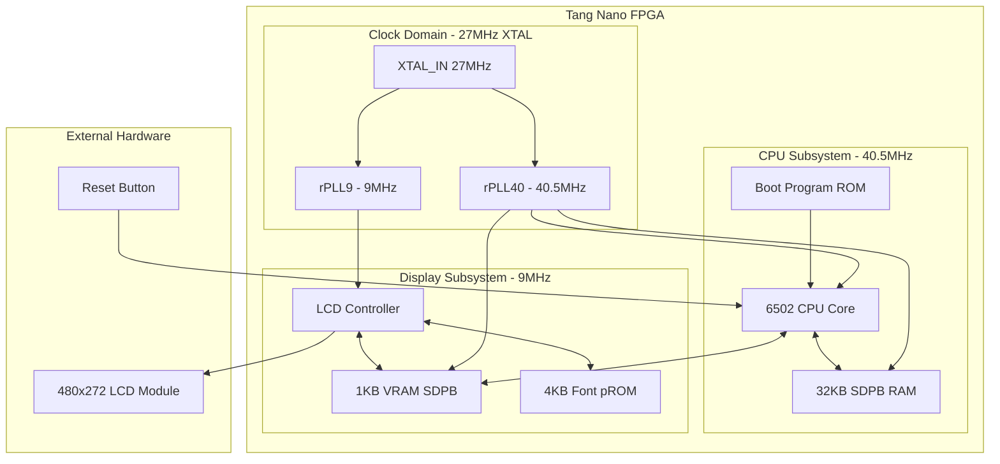
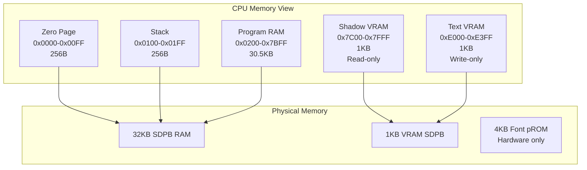
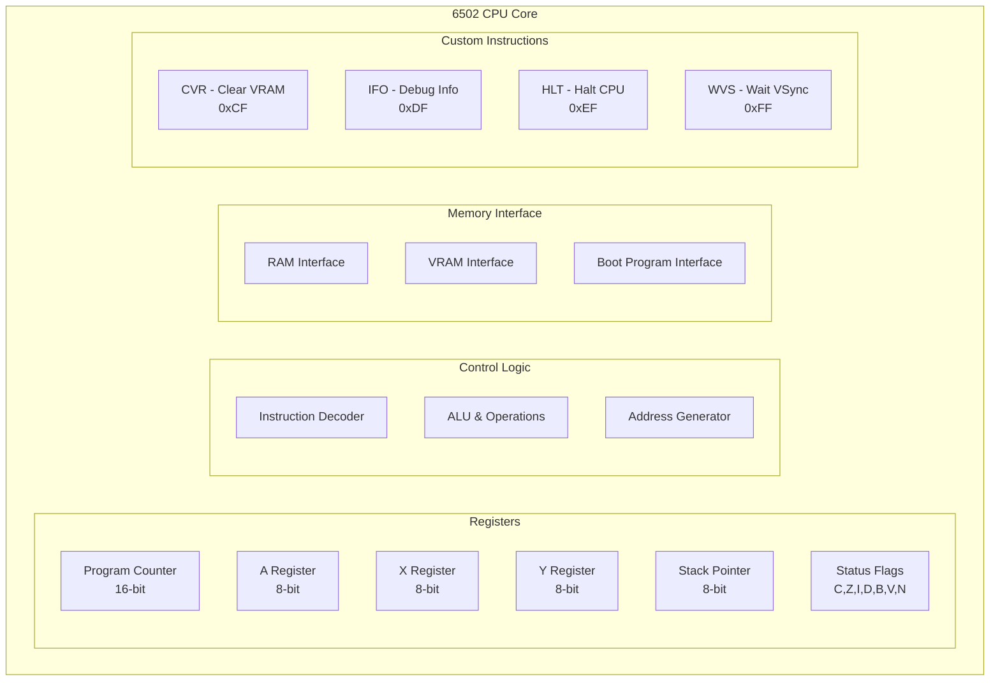
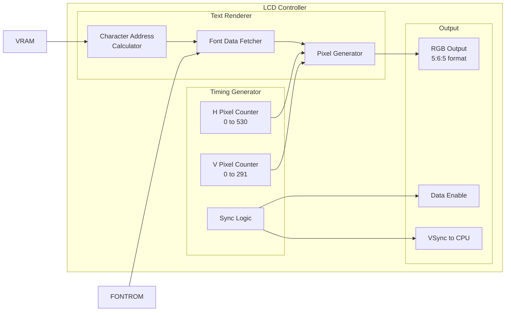
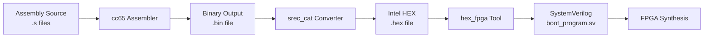
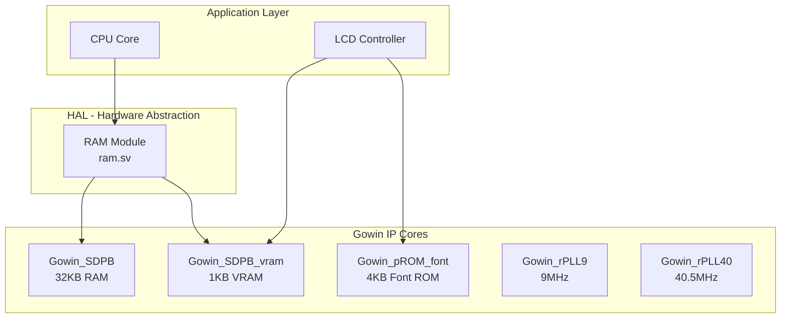
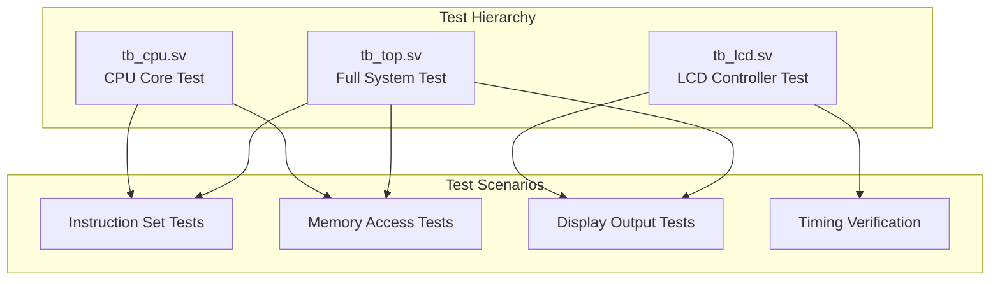

# Developer Documentation

## System Architecture Overview

This document provides technical details about the Tang Nano LCD + 6502 CPU implementation, including component relationships and internal architecture discovered through code analysis.

## System Block Diagram



## Component Analysis

### Core Modules

| Module | Purpose | Clock Domain | Key Features |
|--------|---------|--------------|--------------|
| `top.sv` | System integration | Multiple | PLL instantiation, clock distribution |
| `cpu.sv` | 6502 processor core | 40.5MHz | Custom instruction extensions, memory interface |
| `lcd.sv` | Display controller | 9MHz | Text rendering, timing generation |
| `ram.sv` | Memory controller | 40.5MHz | Dual-port access wrapper |

### Memory Architecture



### CPU Core Architecture



### LCD Controller Architecture



## Memory Map Details

### Address Space Layout
```
0x0000-0x00FF: Zero Page (256B)
  ├── CPU zero page operations
  └── Fast access variables

0x0100-0x01FF: Stack (256B) 
  ├── Referenced as STACK + sp
  └── Hardware stack operations

0x0200-0x7BFF: Program RAM (30.5KB)
  ├── Boot program loads at 0x0200
  ├── Program execution space
  └── General purpose RAM

0x7C00-0x7FFF: Shadow VRAM (1KB)
  ├── CPU-readable copy of VRAM
  ├── Mirrors actual VRAM content
  └── Used for read-back operations

0xE000-0xE3FF: Text VRAM (1KB)
  ├── Write-only from CPU perspective
  ├── 60 columns × 17 rows = 1020 bytes
  └── Direct character code mapping

0xF000-0xFFFF: Font ROM (4KB)
  ├── Not CPU accessible
  ├── Hardware-only access via LCD controller
  └── 16×8 pixel character bitmaps
```

### Text Display Layout
```
Text Grid: 60 columns × 17 rows
Character Size: 16×8 pixels
Display Resolution: 480×272 pixels

Memory Layout:
VRAM[0x000] = Column 0, Row 0 (top-left)
VRAM[0x001] = Column 1, Row 0
...
VRAM[0x03B] = Column 59, Row 0 (top-right)
VRAM[0x03C] = Column 0, Row 1
...
VRAM[0x3FB] = Column 59, Row 16 (bottom-right)
```

## Clock Domain Analysis

### Clock Distribution
- **27MHz XTAL**: External crystal oscillator input
- **9MHz LCD_CLK**: Generated by rPLL9 for LCD timing
- **40.5MHz MEMORY_CLK**: Generated by rPLL40 for CPU and memory

### Timing Relationships
```
LCD Refresh Rate: 9MHz / (531 × 292) ≈ 58Hz
VSync Period: ~17.24ms
Character Display Rate: 58Hz × 1020 chars ≈ 59,160 chars/sec
```

## Custom 6502 Instructions Implementation

### CVR (Clear VRAM) - 0xCF
```systemverilog
// Clears entire 1KB VRAM to 0x00
// Implementation sets v_cea=1, v_din=8'h00
// Iterates through all 1024 VRAM addresses
```

### IFO (Info/Debug) - 0xDF
```systemverilog
// Debug instruction with address parameter
// DF addr: Shows registers and memory at addr
// Used for development and debugging
```

### HLT (Halt) - 0xEF  
```systemverilog
// Stops CPU execution
// PC remains at current position
// LCD controller continues operation
```

### WVS (Wait VSync) - 0xFF
```systemverilog
// FF count: Wait for 'count' VSync cycles
// Synchronizes CPU with LCD refresh
// count=0x3A ≈ 1 second delay
```

## Development Tools Integration

### Assembly Toolchain


### Generated Files
- `include/boot_program.sv`: Auto-generated from assembly
- `examples/example.lst`: Assembly listing with addresses
- `examples/example.hex`: Intel HEX format
- `include/cpu_ifo_auto_generated.sv`: Debug support code

## Hardware Abstraction Layers

### Gowin IP Core Integration


## Board Variant Support

### Tang Nano 9K vs 20K Differences

| Aspect | Tang Nano 9K | Tang Nano 20K |
|--------|--------------|---------------|
| FPGA | GW1NR-9C | GW2AR-18C |
| Reset Logic | `rst_n = ResetButton` | `rst_n = !ResetButton` |
| Constraint File | `lcd_cpu_bsram_9K.cst` | `lcd_cpu_bsram_20K.cst` |
| PLL IP | `gowin_rpll_9K/` | `gowin_rpll_20K/` |

### Configuration Management
Three files require modification for board switching:
1. **Makefile**: DEVICE parameter
2. **lcd_cpu_bsram.gprj**: Device and file selections  
3. **src/top.sv**: Reset polarity logic

## Testing Infrastructure

### Simulation Environment
- **DSIM Studio**: Professional SystemVerilog simulator
- **Platform Support**: Linux x64, Windows x64 (not macOS)
- **Testbenches**: CPU, LCD, and full system testing

### Test Coverage


## Performance Characteristics

### System Performance
- **CPU Clock**: 40.5MHz
- **Instructions/Second**: ~10-20 MIPS (varies by instruction)
- **Memory Bandwidth**: 40.5M transactions/second
- **Display Refresh**: 58Hz (17.24ms period)

### Memory Access Patterns
- **RAM Access**: Single cycle for most operations
- **VRAM Write**: Single cycle from CPU
- **Font ROM**: Concurrent access during display rendering
- **Boot Program**: ROM-based, loaded at reset

## Power and Resource Utilization

### FPGA Resource Usage (Typical)
- **LUTs**: ~15-25% of available
- **FFs**: ~10-20% of available  
- **BRAM**: 32KB RAM + 4KB Font ROM + 1KB VRAM
- **PLLs**: 2 PLLs for clock generation

This technical documentation provides developers with the detailed system understanding needed for modification, debugging, and enhancement of the Tang Nano LCD + 6502 CPU project.