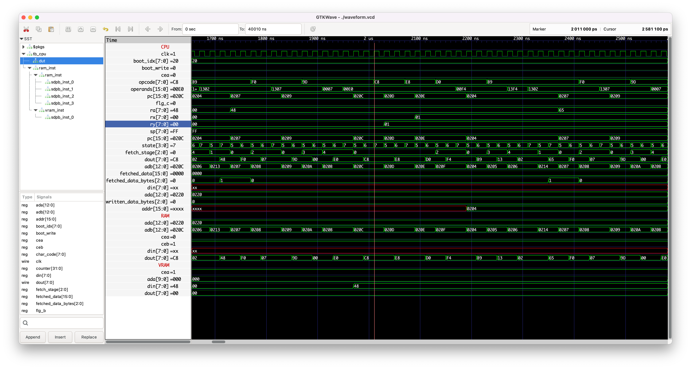
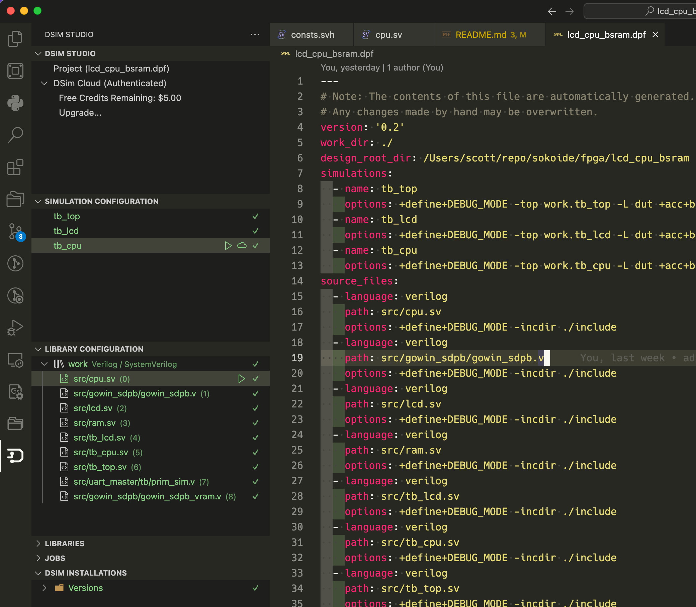

# Tang Nano LCD + 8bit 6502 CPU + BSRAM example

## About

* Tang Nano 9K or 20K + 043026-N6(ML) 4.3 inch 480x272 LCD module example
* Change Makefile, Select Device and update the `.cst` file for 20K

## Getting Started

### Run an Example

```bash
cd examples
# if not installed
brew install srecord cc65
# edit Makefile -> SRCS and change `simple.s` to any of the examples you want to use
make clean
make
# include/boot_program.sv and examples/example.lst are generated
# take a look at the files

cd ../
make download
# the exmple will be compined with the 6502 CPU / LCD controller and copied into Tang Nano
```

## 043026-N6(ML) LCD spec

### Interface PIN connections

| Pin No. | Symbol | Function |
|---------|--------|----------|
| 1       | LEDK   | Back light power supply negative |
| 2       | LEDA   | Back light power supply positive |
| 3       | GND    | Ground |
| 4       | VCC    | Power supply |
| 5-12    | R0-R7  | Red Data |
| 13-20   | G0-G7  | Green Data |
| 21-28   | B0-B7  | Blue Data |
| 29      | GND    | Ground |
| 30      | CLK    | Clock signal |
| 31      | DISP   | Display on/off |
| 32      | HSYNC  | Horizontal sync input in RGB mode (short to GND if not used) |
| 33      | VSYNC  | Vertical sync input in RGB mode (short to GND if not used) |
| 34      | DE     | Data enable |
| 35      | NC     | No Connection |
| 36      | GND    | Ground |
| 37      | XR     | Touch panel X-right |
| 38      | YD     | Touch panel Y-bottom |
| 39      | XL     | Touch panel X-left |
| 40      | YU     | Touch panel Y-up |


### Parallel RGP Input Timing

| Item   | Symbol| Values (Min.) | Values (Typ.) | Values (Max.) | Unit  | Remark |
|--------|-------|---------------|---------------|---------------|-------|--------|
| DCLK Frequency | Fclk    | 8    | 9    | 12   | MHz  ||
| **Hsync**      |         |      |      |      |      ||
| Period time    | Th      | 485  | 531  | 589  | DCLK ||
| Display Period | Thdisp  | -    | 480- | -    | DCLK ||
| Back Porch     | Thbp    | 3    | 43   | 43   | DCLK ||
| Front Porch    | Thfp    | 2    | 4    | 75   | DCLK ||
| **Vsync**      |         |      |      |      |      ||
| Period time    | Tv      | 276  | 292  | 321  | H    ||
| Display Period | Tvdisp  | -    | 272  | -    | H    ||
| Back Porch     | Tvbp    | 2    | 12   | 12   | H    ||
| Front Porch    | Tvfp    | 2    | 4    | 37   | H    ||

### Sync Mode


### Sync DE Mode


## Example


## Implemented Instructions

* **+**: implemented
  * All 6502 instructions except for the followings
* **-**: not going to be implemented
  * break, interrupt related oned
* ' ' (blank) : not implemented yet
  * (Indirect X)
  * (Indirect), Y
* **!**: custom instruction which is not available in 6502
  * `0xCF` CVR: Clear VRAM
    * CF: (no operand) clear VRAM
  * `0xDF` IFO: Info ... show registers and memory
    * DF 0000: show registers and 0x0000-0x007F
    * DF 8000: show registers and 0x0080-0x00FF
    * DF 8010: show registers and 0x1080-0x10FF
  * `0xEF` HLT: Halt ... stop the CPU
    * EF: (no operand) stop the CPU. LCD controller continues running
  * `0xFF` WVS: Wait For VSync ... wait until the next vsync timing of the LCD
    * FF 00: wait for vsync once (~1/58 sec)
    * FF 05: wait for vsync 6 times (~6/58 sec)
    * FF 3A: wait for vsync 58 times (~1 sec)

|     | 0x0 | 0x1 | 0x2 | 0x3 | 0x4 | 0x5 | 0x6 | 0x7 | 0x8 | 0x9 | 0xA | 0xB | 0xC | 0xD | 0xE | 0xF |
|-----|-----|-----|-----|-----|-----|-----|-----|-----|-----|-----|-----|-----|-----|-----|-----|-----|
| 0x0 | BRK | ORA |     |     |     | ORA | ASL |     | PHP | ORA | ASL |     |     | ORA | ASL |     |
|     | impl| idx |     |     |     | zp  | zp  |     | impl| imm | acc |     |     | abs | abs |     |
|     | -   |     |     |     |     | +   | +   |     | +   | +   | +   |     |     | +   | +   |     |
| 0x1 | BPL | ORA |     |     |     | ORA | ASL |     | CLC | ORA |     |     |     | ORA | ASL |     |
|     | rel | idy |     |     |     | zpx | zpx |     | impl| aby |     |     |     | abx | abx |     |
|     | +   |     |     |     |     | +   | +   |     | +   | +   |     |     |     | +   | +   |     |
| 0x2 | JSR | AND |     |     | BIT | AND | ROL |     | PLP | AND | ROL |     | BIT | AND | ROL |     |
|     | abs | idx |     |     | zp  | zp  | zp  |     | impl| imm | acc |     | abs | abs | abs |     |
|     | +   |     |     |     | +   | +   | +   |     | +   | +   | +   |     | +   | +   | +   |     |
| 0x3 | BMI | AND |     |     |     | AND | ROL |     | SEC | AND |     |     |     | AND | ROL |     |
|     | rel | idy |     |     |     | zpx | zpx |     | impl| aby |     |     |     | abx | abx |     |
|     | +   |     |     |     |     | +   | +   |     | +   | +   |     |     |     | +   | +   |     |
| 0x4 | RTI | EOR |     |     |     | EOR | LSR |     | PHA | EOR | LSR |     | JMP | EOR | LSR |     |
|     | impl| idx |     |     |     | zp  | zp  |     | impl| imm | acc |     | abs | abs | abs |     |
|     | -   |     |     |     |     | +   | +   |     | +   | +   | +   |     | +   | +   | +   |     |
| 0x5 | BVC | EOR |     |     |     | EOR | LSR |     | CLI | EOR |     |     |     | EOR | LSR |     |
|     | rel | idy |     |     |     | zpx | zpx |     | impl| aby |     |     |     | abx | abx |     |
|     | +   |     |     |     |     | +   | +   |     | -   | +   |     |     |     | +   | +   |     |
| 0x6 | RTS | ADC |     |     |     | ADC | ROR |     | PLA | ADC | ROR |     | JMP | ADC | ROR |     |
|     | impl| idx |     |     |     | zp  | zp  |     | impl| imm | acc |     | ind | abs | abs |     |
|     | +   |     |     |     |     | +   | +   |     | +   | +   | +   |     | +   | +   | +   |     |
| 0x7 | BVS | ADC |     |     |     | ADC | ROR |     | SEI | ADC |     |     |     | ADC | ROR |     |
|     | rel | idy |     |     |     | zpx | zpx |     | impl| aby |     |     |     | abx | abx |     |
|     | +   |     |     |     |     | +   | +   |     | -   | +   |     |     |     | +   | +   |     |
| 0x8 |     | STA |     |     | STY | STA | STX |     | DEY |     | TXA |     | STY | STA | STX |     |
|     |     | idx |     |     | zp  | zp  | zp  |     | impl|     | impl|     | abs | abs | abs |     |
|     |     |     |     |     | +   | +   | +   |     | +   |     | +   |     | +   | +   | +   |     |
| 0x9 | BCC | STA |     |     | STY | STA | STX |     | TYA | STA | TXS |     |     | STA |     |     |
|     | rel | idy |     |     | zpx | zpx | zpy |     | impl| aby | impl|     |     | abx |     |     |
|     | +   | +   |     |     | +   | +   | +   |     | +   | +   | +   |     |     | +   |     |     |
| 0xA | LDY | LDA | LDX |     | LDY | LDA | LDX |     | TAY | LDA | TAX |     | LDY | LDA | LDX |     |
|     | imm | idx | imm |     | zp  | zp  | zp  |     | impl| imm | impl|     | abs | abs | abs |     |
|     | +   |     | +   |     | +   | +   | +   |     | +   | +   | +   |     | +   | +   | +   |     |
| 0xB | BCS | LDA |     |     | LDY | LDA | LDX |     | CLV | LDA | TSX |     | LDY | LDA | LDX |     |
|     | rel | idy |     |     | zpx | zpx | zpy |     | impl| aby | impl|     | abx | abx | aby |     |
|     | +   |     |     |     | +   | +   | +   |     | +   | +   | +   |     | +   | +   | +   |     |
| 0xC | CPY | CMP |     |     | CPY | CMP | DEC |     | INY | CMP | DEX |     | CPY | CMP | DEC | CVR |
|     | imm | idx |     |     | zp  | zp  | zp  |     | impl| imm | impl|     | abs | abs | abs | impl|
|     | +   |     |     |     | +   | +   | +   |     | +   | +   | +   |     | +   | +   | +   | !    |
| 0xD | BNE | CMP |     |     |     | CMP | DEC |     | CLD | CMP |     |     |     | CMP | DEC | IFO |
|     | rel | idy |     |     |     | zpx | zpx |     | impl| aby |     |     |     | abx | abx | abs |
|     | +   |     |     |     |     | +   | +   |     | -   | +   |     |     |     | +   | +   | !   |
| 0xE | CPX | SBC |     |     | CPX | SBC | INC |     | INX | SBC | NOP |     | CPX | SBC | INC | HLT |
|     | imm | idx |     |     | zp  | zp  | zp  |     | impl| imm | impl|     | abs | abs | abs | impl|
|     | +   |     |     |     | +   | +   | +   |     | +   | +   | +   |     | +   | +   | +   | !   |
| 0xF | BEQ | SBC |     |     |     | SBC | INC |     | SED | SBC |     |     |     | SBC | INC | WVS |
|     | rel | idy |     |     |     | zpx | zpx |     | impl| aby |     |     |     | abx | abx | imm |
|     | +   |     |     |     |     | +   | +   |     | -   | +   |     |     |     | +   | +   | !   |

## 6502 Addressing Modes - Legend

| Abbrev | Full Name    | Description                                                                 |
|--------|--------------|-----------------------------------------------------------------------------|
| impl   | Implied      | No operand needed. Used for instructions like `CLC`, `RTS`, `SEI`, etc.     |
| acc    | Accumulator  | Operates directly on the accumulator (A register), e.g., `ASL A`            |
| imm    | Immediate    | The operand is a constant value, e.g., `LDA #$01`                           |
| zp     | Zero Page    | Uses a one-byte address ($00–$FF), e.g., `LDA $10`                          |
| zpx    | Zero Page,X  | Zero page address plus the X register, e.g., `LDA $10,X`                    |
| zpy    | Zero Page,Y  | Zero page address plus the Y register, e.g., `LDX $10,Y`                    |
| abs    | Absolute     | Full 16-bit address, e.g., `LDA $1234`                                      |
| abx    | Absolute,X   | Absolute address plus X, e.g., `LDA $1234,X`                                |
| aby    | Absolute,Y   | Absolute address plus Y, e.g., `LDA $1234,Y`                                |
| ind    | Indirect     | Used only with `JMP`, jumps to the address stored at the given address, e.g., `JMP ($1234)` |
| idx    | (Indirect,X) | Indirect address from zero page plus X, e.g., `LDA ($10,X)`                 |
| idy    | (Indirect),Y | Indirect address from zero page, then add Y, e.g., `LDA ($10),Y`            |
| rel    | Relative     | Offset relative to the program counter (used for branches), e.g., `BEQ $10`|


## Memory Map

```text
Total 8KB RAM:
0x0000-0x00FF: Zero Page (256B)
0x0100-0x01FF: Stack (256B)
0x0200-0x1FFF: RAM (7.5KB)

Total 1KB VRAM (SDPB):
0xE000-0xE3FF: Text VRAM (1KB)
```

## Font ROM

* Used [Sweet16Font](https://github.com/kmar/Sweet16Font) licensed under boost software license, meaning you don't have to give credit/embed license

```text
Total 4KB Font ROM (pROM):
Not mapped, can't access from CPU. Only 128 chars are embeded so far. Code 128-255 may be used for games, etc.
pROM address: 0x0000-0x0FFF: Font ROM (4KB)
  16x8 ‎ = 128bits = 16bytes / char
  16 bytes x 256 chars ‎ =  4KB
```

## Test

### Test Bench Example for Hello World

* Here is a waveform by DSim Desktop when the following Hello World example ran.
* The 1st byte (0xA9) is loaded at 0x0200.
* You can find the Y register `ry` incremented at PC=0x020C (boot_program[12]) which is `INY` (0xC8).



```systemverilog
    // Hello World
    boot_program[0]  = 8'hA0;  // LDY #0
    boot_program[1]  = 8'h00;
    boot_program[2]  = 8'hA2;  // LDX #0
    boot_program[3]  = 8'h00;
    boot_program[4]  = 8'hB9;  // loop: LDA message, Y
    boot_program[5]  = 8'h13;
    boot_program[6]  = 8'h02;
    boot_program[7]  = 8'hF0;  // BEQ done
    boot_program[8]  = 8'h07;
    boot_program[9]  = 8'h9D;  // STA $E000, X; $E000 is a top-left corder of text VRAM
    boot_program[10] = 8'h00;
    boot_program[11] = 8'hE0;
    boot_program[12] = 8'hC8;  // INY
    boot_program[13] = 8'hE8;  // INX
    boot_program[14] = 8'hD0;  // BNE loop
    boot_program[15] = 8'hF4;
    boot_program[16] = 8'h4C;  // done: JMP done (infinite loop)
    boot_program[17] = 8'h10;
    boot_program[18] = 8'h12;
    boot_program[19] = 8'h48;  // message: Hello World!, 0
    boot_program[20] = 8'h65;  // 'H'
    boot_program[21] = 8'h6C;  // 'e'
    boot_program[22] = 8'h6C;  // 'l'
    boot_program[23] = 8'h6F;  // 'l'
    boot_program[24] = 8'h20;  // ...
    boot_program[25] = 8'h57;
    boot_program[26] = 8'h6F;
    boot_program[27] = 8'h72;
    boot_program[28] = 8'h6C;
    boot_program[29] = 8'h64;
    boot_program[30] = 8'h21;
    boot_program[31] = 8'h00;  // 0 terminator
```

### How to Run the test

* Run VSCode (remote server) on x64 Linux or Windows
  * Unfortunately, it doesn't support macOS
  * x64 Ubuntu on Apple Silicon macOS is fine to run it
* Install DSIM Studio plug-in on the remote Linux/local Windows, register yourself and activate it
* Change paths in ldc_cpu_bsram.dpf
* Open the updated dpf project in DSIM
* Configure and run "library configuration" then `tb_cpu` in "Simulation Configuration"

