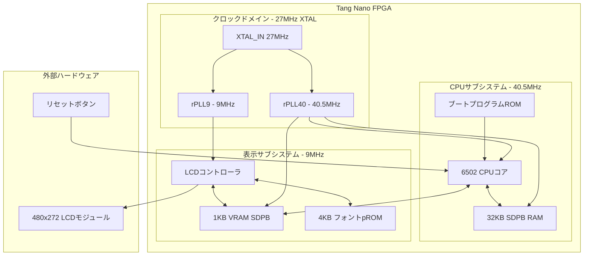
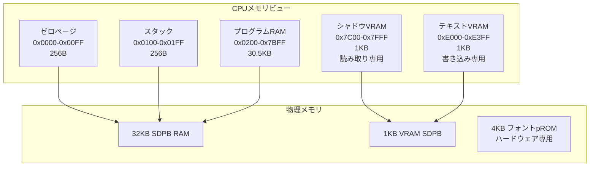
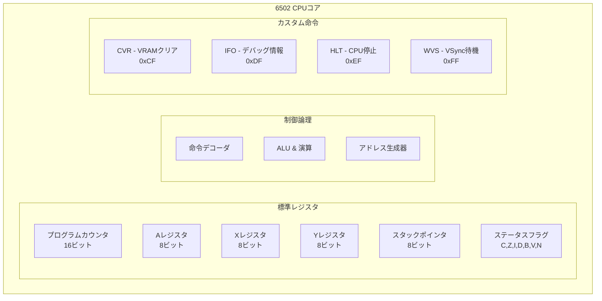
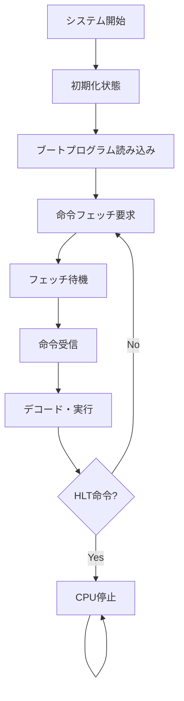
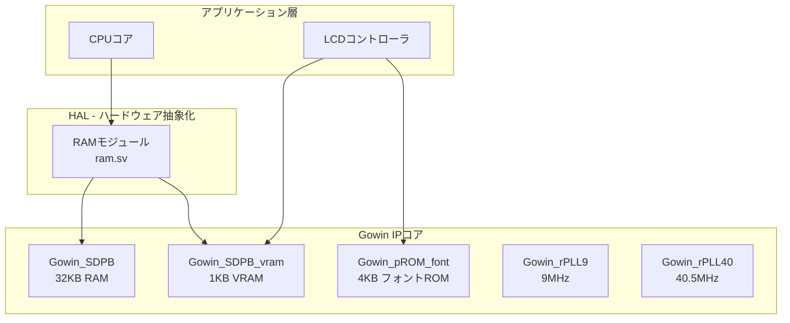

# 6502 CPUエミュレータ アーキテクチャ詳細

このプロジェクトの6502 CPUエミュレータは、Tang Nano 9K/20K FPGA上でSystemVerilogで実装されたシステムです。以下、命令のフェッチと実行がどのように行われるかを詳しく説明します。

## 1. 全体的なアーキテクチャ

### システム全体の構成



- **27MHz外部クリスタル**から2つのPLLで異なるクロックドメインを生成
- **rPLL9**: 9MHz (LCD表示用)
- **rPLL40**: 40.5MHz (CPU・メモリ用)

### 状態マシン設計

このCPUは状態マシンベースで設計されており、以下の主要な状態で動作します：

- **INIT/INIT_RAM**: 初期化とブートプログラムの読み込み
- **FETCH_REQ/FETCH_WAIT/FETCH_RECV**: 命令フェッチ
- **DECODE_EXECUTE**: 命令デコードと実行
- **HALT**: CPU停止状態

**クロックドメイン設計:**
- **CPUサブシステム(40.5MHz)**: CPU、32KB RAM、ブートプログラムROM
- **表示サブシステム(9MHz)**: LCDコントローラ、1KB VRAM、4KBフォントROM

## 2. 命令フェッチメカニズム

### フェッチパイプライン

命令フェッチは段階的に行われます：

1. **FETCH_OPCODE**: オペコード（命令コード）をフェッチ
2. **FETCH_OPERAND1**: 1バイトオペランドをフェッチ
3. **FETCH_OPERAND1OF2/FETCH_OPERAND2**: 2バイトオペランドを分割してフェッチ

### 最適化されたフェッチ処理

```systemverilog
// プログラムカウンタの事前計算（タイミング最適化）
pc_plus1 <= (pc + 16'd1) & RAMW;
pc_plus2 <= (pc + 16'd2) & RAMW;
pc_plus3 <= (pc + 16'd3) & RAMW;
```

この事前計算により、次のメモリアクセスを1クロック早く開始できます。

## 3. 命令デコードと実行

### DECODE_EXECUTE状態での処理

フェッチされたオペコードに基づいて、巨大なcaseステートメントで命令を分岐します：

```systemverilog
case (opcode)
    8'hEA: begin  // NOP
        fetch_opcode(1);  // 1バイト命令なのでPC+1
    end
    8'hA9: begin  // LDA immediate
        ra = operands[7:0];  // Aレジスタに値をロード
        flg_z = (ra == 8'h00);  // ゼロフラグ設定
        flg_n = ra[7];  // ネガティブフラグ設定
        fetch_opcode(2);  // 2バイト命令なのでPC+2
    end
```

### 複数サイクル命令の処理

複雑な命令（間接アドレッシングなど）は、`fetched_data_bytes`カウンタを使用して段階的に実行されます：

```systemverilog
case (fetched_data_bytes)
    0: begin
        fetch_data(operands[15:0] & RAMW);  // 第1段階
    end
    1: begin
        fetched_data[7:0] = dout_r;  // 第2段階
        fetch_data((operands[15:0] + 1) & RAMW);
    end
    2: begin
        // 最終段階 - 実際のアドレスを計算して実行
        automatic logic [15:0] addr = {dout_r, fetched_data[7:0]};
        // 実行処理...
    end
endcase
```

## 4. メモリアーキテクチャ

### メモリマップ



**詳細アドレスマップ:**
- **0x0000-0x00FF**: ゼロページ (256B)
- **0x0100-0x01FF**: スタック領域 (256B)
- **0x0200-0x7BFF**: プログラムRAM (30.5KB)
- **0x7C00-0x7FFF**: シャドウVRAM (1KB) - CPU読み取り専用
- **0xE000-0xE3FF**: テキストVRAM (1KB) - CPU書き込み専用
- **0xF000-0xFFFF**: フォントROM (4KB) - ハードウェア専用アクセス

### 物理メモリ構成

- **32KB SDPB RAM**: CPU汎用メモリ
- **1KB VRAM SDPB**: 表示用メモリ（60列×17行=1020バイト使用）
- **4KB フォントpROM**: 16×8ピクセル文字ビットマップ

### 特殊な書き込み処理

VRAMアドレス（0xE000-0xE3FF）への書き込みは、VRAMとシャドウVRAMの両方に同時に書き込まれます：

```systemverilog
if (addr >= VRAM_START && addr < VRAM_START + (COLUMNS * ROWS)) begin
    v_ada <= (addr - VRAM_START) & VRAMW;  // VRAM書き込み
    v_din <= data;
    ada   <= (addr - VRAM_START + SHADOW_VRAM_START) & RAMW;  // シャドウVRAM書き込み
    din   <= data;
end
```

### テキスト表示レイアウト

- **60列×17行**のテキストグリッド、各文字**16×8ピクセル**
- **表示解像度**: 480×272ピクセル
- **リフレッシュレート**: 約58Hz (9MHz ÷ (531×292))

## 5. カスタム6502拡張命令

### 実装された拡張命令



標準的な6502命令に加えて、以下のカスタム命令が実装されています：

#### CVR (0xCF): VRAMクリア
- 全1024バイトのVRAMを0x00でクリア
- `v_cea=1`でVRAM書き込み有効化

#### IFO (0xDF): デバッグ情報表示  
- `DF addr`: 指定アドレスのレジスタとメモリ内容を表示（開発・デバッグ用）

#### HLT (0xEF): CPU停止
- CPU実行を停止、PCは現在位置を維持
- LCDコントローラは動作継続

#### WVS (0xFF): VSyncWait（LCDの垂直同期待機）
- `FF count`: 'count'回のVSync周期待機
- CPUとLCD表示の同期制御
- `count=0x3A`で約1秒の待機時間

## 6. 実行の流れ



1. **初期化**: ブートプログラムがRAMに読み込まれる
2. **フェッチ要求**: PCで指定されたアドレスからオペコードをフェッチ
3. **オペコード受信**: 命令の種類に応じてオペランドフェッチの段階を決定
4. **オペランドフェッチ**: 必要に応じて1-2バイトのオペランドをフェッチ
5. **実行**: デコードされた命令を実行し、レジスタやメモリを更新
6. **次の命令**: PCを更新して次の命令フェッチに戻る

## 7. 最適化技術とハードウェア抽象化

### パフォーマンス最適化

- **パイプライン化**: フェッチとデコードの重複実行
- **事前計算**: PC+1, PC+2, PC+3の事前計算
- **直接データパス**: オペコードフェッチでの1クロック短縮

### システム性能

| 項目 | 値 |
|------|-----|
| CPUクロック | 40.5MHz |
| 命令実行速度 | 約10-20 MIPS（命令により変動） |
| メモリ帯域幅 | 40.5Mトランザクション/秒 |
| 表示リフレッシュ | 58Hz（17.24ms周期） |

### Gowin IPコア統合



- **Gowin_SDPB**: 32KB RAM（デュアルポート）
- **Gowin_SDPB_vram**: 1KB VRAM（表示専用）
- **Gowin_pROM_font**: 4KBフォントROM
- **Gowin_rPLL9/40**: クロック生成PLL

### ボード対応（Tang Nano 9K vs 20K）

| 項目 | Tang Nano 9K | Tang Nano 20K |
|------|--------------|---------------|
| FPGA | GW1NR-9C | GW2AR-18C |
| リセット論理 | `rst_n = ResetButton` | `rst_n = !ResetButton` |
| 制約ファイル | `lcd_cpu_bsram_9K.cst` | `lcd_cpu_bsram_20K.cst` |

## 8. 開発ツールチェーン

### アセンブリ開発パイプライン


1. **.sアセンブリファイル** → cc65アセンブラ
2. **バイナリ出力** → srec_catコンバータ  
3. **Intel HEXファイル** → hex_fpgaツール
4. **SystemVerilog boot_program.sv** → FPGA合成

### テスト環境

- **DSIM Studio**: SystemVerilogシミュレータ（Linux x64, Windows x64対応）
- **テストベンチ**: `tb_cpu.sv`, `tb_lcd.sv`, `tb_top.sv`

## 最新の改善点（2025年8月）

### コード品質とメンテナンス性の向上
- **包括的ドキュメント化**: 全モジュールにおいて英語での統一されたコメントとドキュメンテーション
- **可読性の改善**: マジックナンバーの定数化、意味のある変数名への変更
- **コーディング標準**: 一貫したフォーマットとコメント規約の適用

### CPUアーキテクチャのモジュール化
従来の単一の巨大な`cpu.sv`（2,659行）を機能別に分割し、保守性を大幅に向上させました：

#### 新しいモジュール構造
```systemverilog
cpu.sv (メインCPUコア)
├── cpu_decoder.sv    // 命令デコードロジック（400行）
├── cpu_alu.sv        // 算術論理演算ユニット（180行）
└── cpu_memory.sv     // メモリインターフェース（200行）
```

#### モジュール化の利点
- **命令デコーダ（cpu_decoder.sv）**: オペコード解析と制御信号生成を独立したモジュールに分離
- **ALU（cpu_alu.sv）**: 算術・論理演算とフラグ計算を専用モジュール化
- **メモリインターフェース（cpu_memory.sv）**: アドレス生成とメモリアクセス制御の抽象化

### テスト体系の強化
#### 新しいテストベンチ
- **tb_cpu_modules.sv**: 個別モジュールの単体テスト（400行、25+テストケース）
- **tb_cpu.sv拡張**: 統合テストケースを9つのカテゴリに体系化（300行に拡張）

#### テストカバレッジ
1. リセット動作検証
2. 即値ロード命令（LDA immediate）
3. 絶対アドレス格納（STA absolute）
4. 算術演算（ADC, SBC）
5. 分岐命令（BEQ, BNE）
6. スタック操作（PHA, PLA）
7. カスタム命令（CVR, WVS, HLT）
8. VRAM操作
9. アドレッシングモードの網羅的テスト

### 開発支援の改善
- **Claude Codeドキュメンテーション**: `claudedocs/`ディレクトリに包括的な分析レポート
- **ビルドシステムの最適化**: 新モジュールの自動統合
- **デバッグ支援**: より詳細なテストログと診断情報

## まとめ

この実装は、標準的な6502アーキテクチャを忠実に再現しながら、FPGA環境とLCD表示に特化したカスタム拡張を提供する、非常によく設計されたCPUエミュレータです。特に、命令フェッチの最適化と複数サイクル命令の段階的実行が巧妙に実装されており、異なるクロックドメインを使用した効率的なシステム設計が特徴的です。

**2025年の改善により、このプロジェクトは以下の特徴を獲得しました：**
- **高い保守性**: モジュール化された設計により、各コンポーネントの独立した開発・テストが可能
- **包括的なテスト**: 単体テストから統合テストまで、信頼性の高い検証体系
- **優れた可読性**: 統一されたドキュメントと明確なコード構造
- **将来への拡張性**: 新機能の追加や改良が容易な柔軟なアーキテクチャ